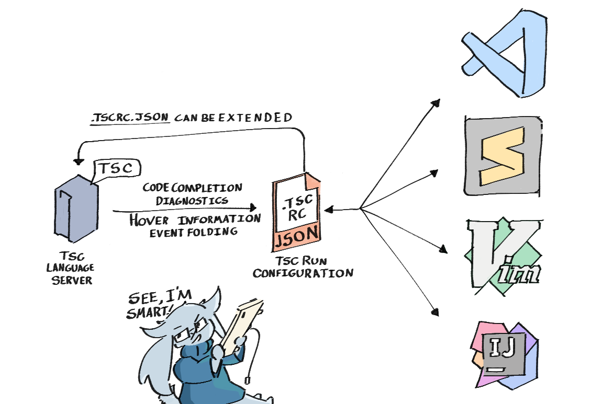

# TSC Language Server

A language server made for the TSC scripting format used in games such as Cave
Story. It aims to be small, performant, and completely editor-agnostic. The
language server implements the [`.tscrc.json` spec][tscrc-spec].



## Project Overview

The language server is written in the Go programming language and ships as a
standalone binary. Language clients can connect to the server through TCP or
stdio.

Please note that this language server is currently not 100% stable, so bugs may
appear here and there.

## Features

- Hover information
- Diagnostics
  - Event duplication checking
  - Command usage validation
  - Message box text overflow checking
- Completions
- Event folding
- Event symbols (outline + go to event)

## Getting Started

Language clients should usually install the language server for you
automatically, yet you can also install it manually. In this case, you have to
keep it up to date yourself, however.

You can download a binary from the [GitHub releases page][releases]. Checksums
are always attached so you can verify the integrity after download. Placing the
binary somewhere in your PATH means that language clients will be able to use it
without any additional steps.

### For Debian users

If you have Debian or a Debian-based system, you can use our Debian package
repository to install and update the TSC Language Server globally.

Run the following commands in succession:

```sh
echo "deb https://deb.nimblebun.works/debian stable main" | sudo tee /etc/apt/sources.list.d/nimblebun.list
sudo apt-key adv --keyserver keyserver.ubuntu.com --recv-keys 033D0D4895F432D1
sudo apt update
sudo apt install tsc-ls
```

### For Arch Linux users

If you have Arch Linux or an Arch-based system (e.g. Manjaro), you can install
the TSC Language Server globally through [AUR][aur-link].

Example using `yay`:

```sh
yay -S tsc-ls
```

## Usage

You can start the server in one of two modes:

- Standard I/O mode (by running `tsc-ls start`)
- TCP mode (by running `tsc-ls tcp`)

...however, you'd usually want a language client to handle this for you (a
plugin or configuration in your IDE/editor).

### Editor/IDE Guides

You can view the instructions for getting started with the TSC Language Server
in your favorite code editor/IDE in [GUIDES.md][language-client-guides].

## For Language Client Developers

The TSC language server exposes the following LSP-specific JSON-RPC methods:

- `textDocument/didOpen` - adds the opened document to the language server's
  file handler
- `textDocument/didClose` - removes the document from the language server's file
  handler
- `textDocument/didChange` - updates the document in the language server's file
  handler and sends error/warning diagnostics to the client
- `textDocument/completion` - sends a list of TSC commands that can be used from
  within the editor's autocompletion feature
- `textDocument/documentSymbol` - sends a list of TSC events that can be found
  in the opened file
- `textDocument/foldingRange` - sends a list of event ranges that can be used
  for folding
- `textDocument/hover` - provides hover information for commands and events
- `tsc/setConfig` - updates the LSP's default configuration with overrides from
  the workspace's `.tscrc.json` file
- `tsc/resetConfig` - reverts to the LSP's built-in (standard) TSC configuration

Additionally, some required methods are also exposed, such as `initialize`,
`initialized`, `shutdown`, `exit`, and `$/cancelRequest`.

## Credits

- [Studio Pixel][studio-pixel] and [Nicalis][nicalis] for Cave Story and the TSC
  scripting format
- The [Terraform Language Server][terraform-ls] for inspiring a big part of this
  project's structure and inner workings (seriously guys, you did a phenomenal
  job!)

## License

[MIT](https://github.com/nimblebun/tsc-language-server/blob/master/LICENSE).

[tscrc-spec]: https://docs.nimblebun.works/tscrc-json
[releases]: https://github.com/nimblebun/tsc-language-server/releases/latest
[studio-pixel]: https://studiopixel.jp/
[nicalis]: https://www.nicalis.com/
[terraform-ls]: https://github.com/hashicorp/terraform-ls
[language-client-guides]: https://github.com/nimblebun/tsc-language-server/blob/master/GUIDES.md
[aur-link]: https://aur.archlinux.org/packages/tsc-ls
